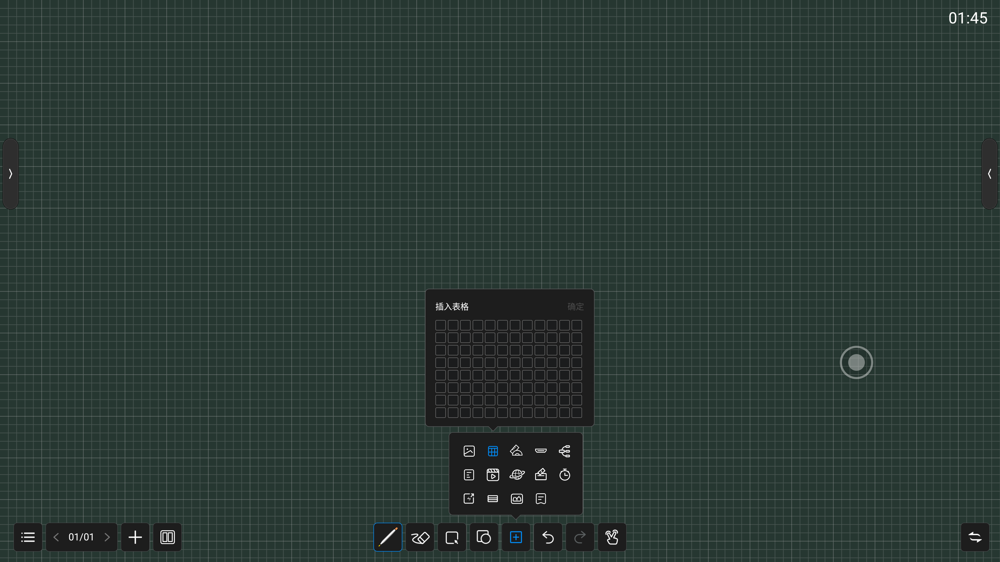
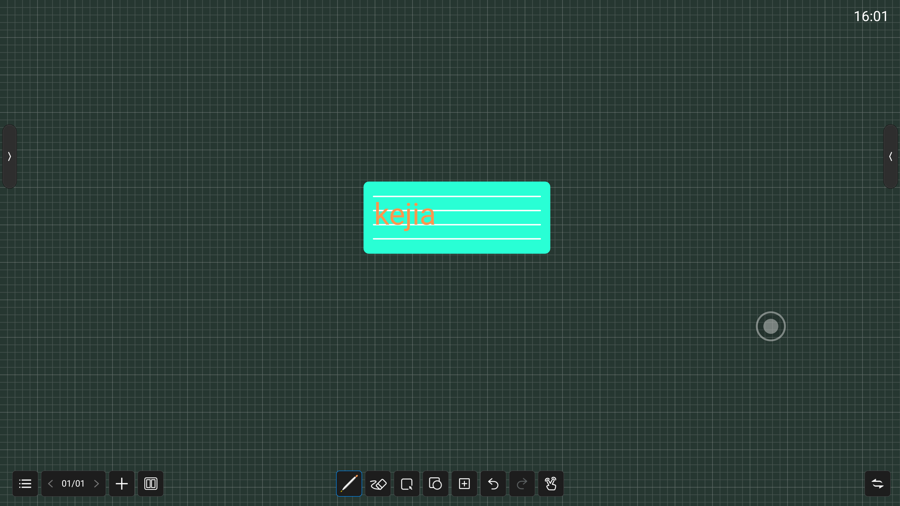
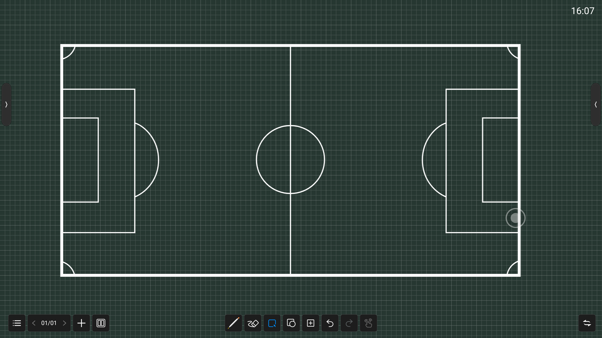

# 德远白板软件功能拆解

## 1. 笔设置

粗细笔可分别设置以下选项

颜色：9种常规固定颜色，1种彩虹彩色，1种自定义设置（可选颜色及明度）

粗细：2-16

画笔选择：

1. 常规笔

2. 排笔

3. 钢笔（有软件模拟粗细变化）

4. 字体识别笔（手写字体识别后显示为印刷体）

   

5. 形状识别笔（手画线条识别为规范形状）

## 2. 橡皮擦

局部擦除

选择擦除

滑动清屏

## 3. 选择

变换颜色

网络查找

复制

删除

## 4. 绘制图形

可绘制如图20种线条或图形

## 5. 插入

- 插入本机图片

- 插入表格（最大可选8行*12列）

  

- 插入圆规/尺子/量角器

  

  

- 插入信号接口画面（OPS/HDMI1)

- 插入思维导图方框（会根据写字内容的长度自适应方框大小）

  

- 插入文件（默认打开WPS进行文件选择）

- 插入视频

- 插入网页

- 插入投票

- 插入计时器

- 插入快传文字或图片，手机扫描二维码编辑文字或加载图片，上传后可以通过播放幻灯片的形式展示

- 插入拼音四线格，手写的字母可以自动识别为标准字体

- 

- 插入球场模板

  

  

  

- 插入便签

  

## 6. 撤回及恢复

撤回及恢复最多30步

## 7. 两点触控选择按钮

选择两点缩放或两点触控

## 8. 悬浮栏（可以左右切换）

1. 分屏书写：可以选择2分屏、3分屏、4分屏。每个分屏可以分别选择笔触颜色(4个颜色)及大小（3种尺寸），每个分屏有分界，本分区的字迹写不到别的分区。

   

2. 新加页面

3. 左右切换页面

4. 其他：

   

   - 新建

   - 打开

   - 保存

   - 另存为

   - 云盘分享

     可登录账号、选择上传文件的格式（.wbd, .png, .pdf）、可修改文件名

     

   - 扫码

   - 邮件

   - 设置

     

     - 时间显示开关，可选择是否在右上角显示当前时间

     - 背景设置

       

       - 11种固定颜色+1种自定义颜色
       - 8种背景（空白或网格）
       - 自定义图片（尺寸3840*2160，格式为jpg，jpeg，bmp或png）

     - 邮箱设置

       

     - 任务栏开关，此开关设置底部任务栏是常显示或收起

     - **阈值** 可设置粗/细笔/板擦阈值，增强用户体验

       

   - 退出

## 9. 批注

用户可以在主页面的悬浮窗上选择批注
